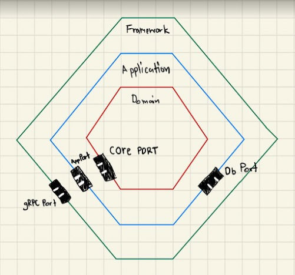

# go.hexagonal-architecture

- each service communicate with `port` interface
- each service completely de-coupling



## project structure

```shell
.
├── README.md
├── cmd
│   └── main.go
├── docker-compose.yml
├── go.mod
├── go.sum
├── hexagonal.png
└── internal
    ├── adapters
    │   ├── app
    │   │   └── api
    │   │       └── api.go
    │   ├── core
    │   │   └── arithmetic
    │   │       ├── arithmetic.go
    │   │       └── arithmetic_test.go
    │   └── framework
    │       ├── left
    │       │   └── grpc
    │       │       ├── pb
    │       │       │   ├── arithmetic_svc.pb.go
    │       │       │   ├── arithmetic_svc_grpc.pb.go
    │       │       │   └── server.go
    │       │       └── proto
    │       │           └── arithmetic_svc.proto
    │       └── right
    │           └── db
    │               └── db.go
    └── ports
        ├── app.go
        ├── core.go
        ├── framework_left.go
        └── framework_right.go
```

## start deps

```shell
docker-compose up 
```

## stop deps

```shell
docker-compose down
```

## generate proto

```shell
brew install protobuf
```

```shell
protoc --go_out=internal/adapters/framework/left/grpc --go-grpc_out=internal/adapters/framework/left/grpc --proto_path=internal/adapters/framework/left/grpc/proto internal/adapters/framework/left/grpc/proto/*.proto
```

## run

```shell
go run cmd/main.go
```

## client test

- install [evans](https://github.com/ktr0731/evans#installation)

```shell
evans internal/adapters/framework/left/grpc/proto/arithmetic_svc.proto
```